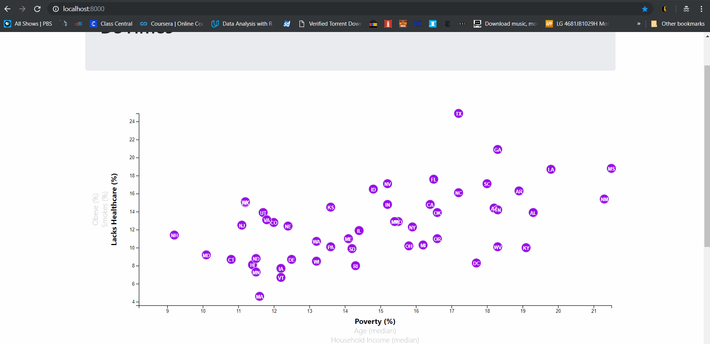
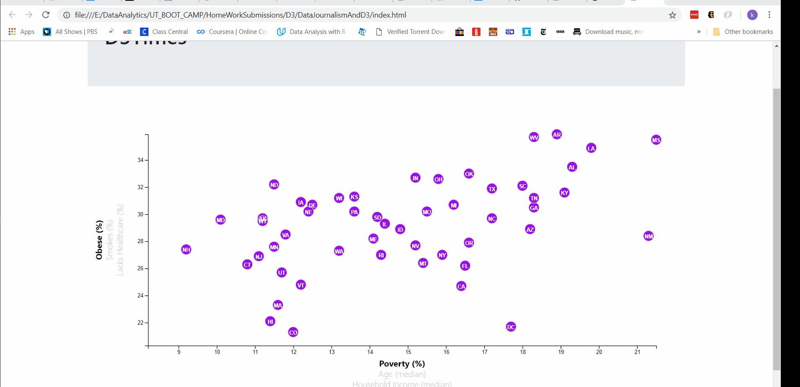

# Interactive Plot built using D3.js

we are studying the current trends shaping people's lives and presenting it in a interactive charts. So welcome to the newsroom!

### Key Findings
* As the poverty rate increases, we generally see increase in obesity, percent of people smoking and lacking healthcare.
* We see almost opposite trend with the increase in MHI (median household income). 
* We do not see any clear trends with age as data is more scattered.
* State of texas pops out in percent of uninsured

### Notes
* Demographics data has been read from url obviating the need for python server (`python -m http.server`) to see the visualization.
* Each circle represents a state (per abbreviation), so the demographics comparison of all states are presented.
* Tooltips added to the circles to display the exact numbers behind the plot. 
Used the `d3-tip.js` plugin developed by [Justin Palmer](https://github.com/Caged)
* Chart resizes automatically with window.

